<div align="center">

# 👁️ Vision Content Extractor
### *Next-Gen Multi-Modal & E-Commerce Content Extraction Engine*

<p align="center">
  <strong>Transform raw web pages, documents, and product visuals into high-fidelity structured data.</strong>
</p>

[](https://github.com/berkaysahin-dev/Vision-Content-Extractor)
[](https://python.org)
[](LICENSE)
[](https://github.com/berkaysahin-dev/Vision-Content-Extractor)
[](https://github.com/berkaysahin-dev)

---

[Overview](#-overview) •
[Key Features](#-key-features) •
[Architecture](#-architecture) •
[Quick Start](#-quick-start) •
[E-Commerce Extraction Schema](#-e-commerce-extraction-schema) •
[Roadmap](#-roadmap) •
[Shaz Vision Ecosystem](#-shaz-vision-ecosystem) •
[Contributing](#-contributing)

</div>

---

## 📖 Overview

**Vision Content Extractor** is an intelligent, vision-augmented content parsing engine engineered for the modern web and document landscape. Built as a core component of the **Shaz Vision E-Com Pack**, it bridges visual intelligence with DOM parsing to reliably extract rich text, complex tables, pricing metrics, variant hierarchies, and product specifications from any source—even JavaScript-heavy single-page applications and unstructured scanned files.

### Why Vision Content Extractor?

Traditional scrapers break when web layouts shift, selectors change, or anti-bot protections obfuscate the DOM. **Vision Content Extractor** combines **multi-modal vision models (LLMs)**, **OCR technology**, and **semantic DOM parsing** to understand web pages the same way humans do.

---

## ✨ Key Features

- **🔍 Multi-Modal Visual Ingestion**  
  Seamlessly process web page screenshots, PDF catalogs, scanned flyers, and high-resolution product imagery.

- **🛍️ E-Commerce Focused Intelligence**  
  Specialized parsers for automated extraction of SKU details, variant matrices (size/color/price), inventory statuses, customer reviews, and technical specifications.

- **⚡ Resilient Dynamic Rendering**  
  Headless browser orchestration with smart waiting algorithms to accurately capture client-rendered SPAs (Shopify, WooCommerce, Amazon, Magento, custom storefronts).

- **🧩 Strict Schema Validation**  
  Outputs pristine, strongly-typed JSON schemas powered by Pydantic models, ready for database ingestion or downstream pipeline processing.

- **🚀 High-Throughput Batch Processing**  
  Asynchronous queue-driven pipeline optimized for distributed crawling and large-scale catalog enrichment.

- **🔗 Shaz Vision Integration**  
  Plug-and-play compatibility with Shaz Vision tools, vector embeddings, and real-time indexing services.

---

## 🏗️ Architecture

```mermaid
flowchart LR
    subgraph Inputs["1. Ingestion Layer"]
        A1[🌐 Dynamic Web URLs]
        A2[📄 PDF Catalogs / Invoices]
        A3[📸 Product Images / Screenshots]
    end

    subgraph CoreEngine["2. Vision & Semantic Engine"]
        B1[🖥️ Headless Browser & DOM Parser]
        B2[👁️ OCR & Multi-Modal Vision LLM]
        B3[🧠 Entity & Attribute Recognizer]
    end

    subgraph Processing["3. Normalization & Validation"]
        C1[🧹 Noise Filter & Cleaner]
        C2[📐 Schema Normalizer]
        C3[🛡️ Pydantic Validation]
    end

    subgraph Output["4. Export & Ecosystem"]
        D1[📦 Structured JSON / CSV]
        D2[⚡ Shaz Vision API / Webhooks]
        D3[🗄️ Database / S3 Storage]
    end

    Inputs --> CoreEngine
    CoreEngine --> Processing
    Processing --> Output
```



---

## 🚀 Quick Start

### 1. Prerequisites

- Python 3.10+
- Node.js 18+ *(for headless rendering dependencies)*
- API Keys for Vision Providers (OpenAI, Google Gemini, Anthropic, or local Ollama)

### 2. Installation

```bash
# Clone the repository
git clone https://github.com/berkaysahin-dev/Vision-Content-Extractor.git
cd Vision-Content-Extractor

# Create a virtual environment
python -m venv venv
# On Windows:
venv\Scripts\activate
# On Linux/macOS:
source venv/bin/activate

# Install dependencies
pip install -r requirements.txt
```

### 3. Environment Configuration

Create a `.env` file in the root directory:

```env
# Vision & LLM Provider Keys
OPENAI_API_KEY=your_openai_key_here
GEMINI_API_KEY=your_gemini_key_here

# Engine Settings
HEADLESS_BROWSER=chromium
EXTRACTION_TIMEOUT=30
LOG_LEVEL=INFO
```

### 4. Basic Usage

#### Python SDK Example

```python
import asyncio
from vision_extractor import VisionExtractor, ExtractionTarget

async def main():
    # Initialize extractor engine
    extractor = VisionExtractor(provider="gemini", model="gemini-2.0-flash")

    # Define target
    target = ExtractionTarget(
        url="https://example.com/product/modern-smart-watch",
        schema_type="ecommerce_product"
    )

    # Run extraction
    result = await extractor.extract(target)
    
    print("Extracted Product:")
    print(result.to_json(indent=2))

if __name__ == "__main__":
    asyncio.run(main())
```

#### CLI Command

```bash
# Extract from a single URL
python -m vision_extractor extract --url "https://example.com/product/item-123" --output product.json

# Batch extract from a file list
python -m vision_extractor batch --file-list targets.txt --out-dir ./extracted_data/
```

---

## 📊 E-Commerce Extraction Schema

Example output structure generated by the engine:

```json
{
  "status": "success",
  "metadata": {
    "source_url": "https://example.com/product/shaz-ultra-watch",
    "extracted_at": "2026-08-15T18:30:00Z",
    "confidence_score": 0.985
  },
  "data": {
    "title": "Shaz Vision Ultra Smartwatch Series 5",
    "brand": "Shaz Vision",
    "sku": "SV-WATCH-005",
    "pricing": {
      "currency": "USD",
      "regular_price": 299.99,
      "sale_price": 249.99,
      "discount_percentage": 16.67
    },
    "availability": {
      "in_stock": true,
      "quantity": 42
    },
    "variants": [
      { "color": "Midnight Black", "size": "44mm", "sku": "SV-WATCH-005-BLK-44" },
      { "color": "Silver Frost", "size": "40mm", "sku": "SV-WATCH-005-SLV-40" }
    ],
    "specifications": {
      "Display": "1.9-inch AMOLED",
      "Battery Life": "Up to 7 days",
      "Water Resistance": "50m (5 ATM)",
      "Sensors": ["Heart Rate", "SpO2", "GPS", "Altimeter"]
    },
    "images": [
      {
        "url": "https://example.com/images/watch-main.jpg",
        "type": "primary",
        "alt": "Front view of Shaz Vision Smartwatch"
      }
    ]
  }
}
```

---

## 🗺️ Roadmap

- [x] Repository architecture & initial specification
- [ ] Core Headless Ingestion Engine (Playwright / Chromium integration)
- [ ] Multi-Model Vision Connector (Gemini 2.0 / GPT-4o / Ollama)
- [ ] E-Commerce Product & Catalog Extraction Module
- [ ] Batch processing pipeline with Celery / Redis queue
- [ ] Document / PDF / Table extraction suite
- [ ] REST API & Webhook Dispatcher
- [ ] Shaz Vision E-Com Pack full native integration

---

## 🌐 Shaz Vision Ecosystem

**Vision Content Extractor** is built to function both as an independent, standalone library and as an integral part of the **Shaz Vision** intelligent commerce suite:

- 🛒 **Shaz Vision E-Com Pack**: End-to-end catalog intelligence, visual search, and automated product enrichment.
- 🎯 **Vision Content Extractor**: High-precision multi-modal extraction engine.
- ⚡ **Shaz Stream Pipeline**: Real-time structured data streaming & alerting.

---

## 🤝 Contributing

Contributions are welcome! If you'd like to improve the extractor, add custom schemas, or support new vision providers:

1. Fork the Project (`https://github.com/berkaysahin-dev/Vision-Content-Extractor/fork`)
2. Create your Feature Branch (`git checkout -b feature/AmazingFeature`)
3. Commit your Changes (`git commit -m 'feat: Add AmazingFeature'`)
4. Push to the Branch (`git push origin feature/AmazingFeature`)
5. Open a Pull Request

---

## 📄 License

Distributed under the **MIT License**. See `LICENSE` for more information.

---

<div align="center">
  <p>Maintained with ❤️ by <strong><a href="https://github.com/berkaysahin-dev">Berkay Şahin</a></strong> & <strong>Shaz Vision</strong></p>
  <p>© 2026 Shaz Vision. All rights reserved.</p>
</div>